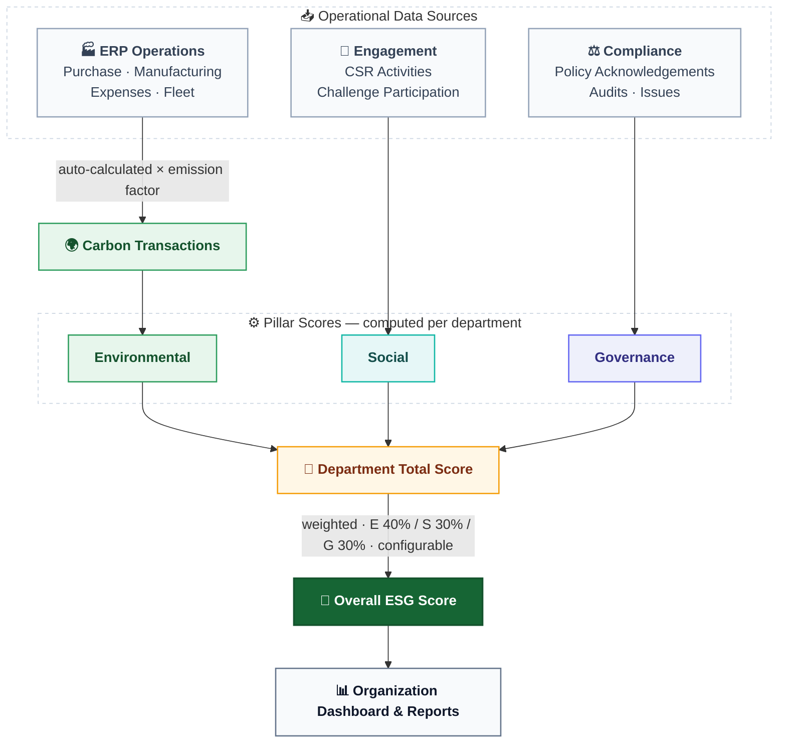

<div align="center">

# EcoSphere — ESG Management Platform

**Measure, manage and improve Environmental, Social & Governance performance — natively inside your ERP.**

[](LICENSE)
[](CONTRIBUTING.md)


[Features](#-features-wip) · [Architecture](#-architecture-wip) · [Quick Start](#-quick-start-wip) · [Contributing](#-contributing-wip)

> 🚧 **Work in progress** — everything below is evolving during the hackathon build.

</div>

---

## 📖 Overview

ESG reporting in most organizations is manual, disconnected and impossible to monitor in real time — even though the ERP already holds the operational data. **EcoSphere** closes that gap: it turns day-to-day ERP operations (purchases, manufacturing, expenses, fleet) into live carbon accounting, drives employee participation through gamification, and rolls everything up into a single **Overall ESG Score** with management-ready reports.

> **Everything is live data.** Dashboards, scores and leaderboards are computed from real database records — no static JSON, no pre-baked numbers. Seed data (emission factors, demo masters) is loaded once at setup; after that, every number moves when records move.

## ✨ Features (WIP)

| Module | What it does |
|---|---|
| 🌍 **Environmental** | Emission factors, automatic carbon transactions from Purchase / Manufacturing / Expense / Fleet records, sustainability goals, department carbon tracking, environmental dashboard |
| 🤝 **Social** | CSR activities, employee participation with proof & approval workflow, diversity metrics, training completion |
| ⚖️ **Governance** | ESG policies & acknowledgements, audits, compliance issues with mandatory owner + due date and automatic overdue flagging |
| 🎮 **Gamification** | Challenge lifecycle (Draft → Active → Under Review → Completed / Archived), XP, auto-awarded badges, redeemable rewards with stock control, leaderboards |
| 📊 **Reporting** | Environmental / Social / Governance / ESG Summary reports + a Custom Report Builder with export to PDF, Excel and CSV |
| 🤖 **AI Copilot** *(differentiator)* | Drop in an invoice or fuel bill → LLM + RAG extracts quantities and books carbon transactions; drafts report narratives. Fully isolated — core scoring never depends on it |

### The scoring spine (WIP)



### Built-in business rules

- **Auto Emission Calculation** — carbon transactions generated automatically from linked ERP records × emission factor (settings toggle)
- **Evidence Requirement** — participation cannot be approved without an attached proof file (settings toggle)
- **Badge Auto-Award** — badges assigned the instant an unlock rule is satisfied
- **Compliance Ownership** — every issue requires an owner and due date; overdue-while-open issues are auto-flagged
- **Reward Redemption** — server-side, transactional point deduction with stock checks
- **Notifications** — in-app/email for compliance issues, approval decisions, policy reminders and badge unlocks

## 🏗 Architecture (WIP)

> Final tech stack is still being decided — the proposed approach below will be confirmed before the build starts.

EcoSphere is designed as a single Odoo addon (`ecosphere`) that **reuses the ERP instead of duplicating it**:

| Odoo module | Used for |
|---|---|
| `hr` | Employees, departments, diversity & training data |
| `purchase`, `mrp`, `hr_expense`, `fleet` | The four operational carbon sources |
| `mail` | Notifications, activities, chatter |
| `base` groups & record rules | Role-based access (Management / ESG Admin / Employee) |
| `ir.cron`, `ir.sequence` | Overdue flagging, reference codes |

**Offline-first:** the whole core platform runs on a local instance with a local database and pre-seeded emission factors (EPA/DEFRA) — no internet required. The AI Copilot is the only network-dependent feature and degrades gracefully when offline.

**Validation-first:** every model ships with layered server-side validation — required fields, cross-field checks, and database-level constraints. The server rejects invalid input; the UI merely explains it.

## 🚀 Quick Start (WIP)

> Detailed setup instructions will land here once the tech stack is locked.

```bash
# 1. Clone the repository
git clone https://github.com/<your-org>/odoo-hack-26.git
cd odoo-hack-26

# 2. Follow the setup steps for the chosen stack (TBD — coming soon)
```

## 🤝 Contributing (WIP)

Contributions are welcome! Please read the [Contributing Guide](CONTRIBUTING.md) for the branch workflow, commit conventions and review checklist, and our [Code of Conduct](CODE_OF_CONDUCT.md).

Found a security issue? Please report it privately — see [SECURITY.md](SECURITY.md).

## 👥 Team

Built with 💚 at the **Odoo Hackathon 2026**.

## 📄 License

Distributed under the MIT License — see [LICENSE](LICENSE) for details.
