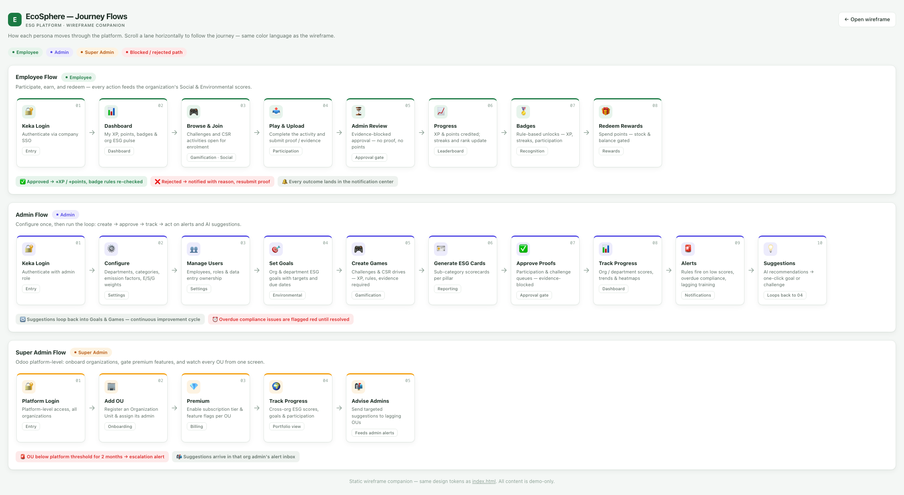

# EcoSphere — Interactive Wireframe

A fully self-contained, clickable wireframe of the EcoSphere ESG platform. **No build step, no dependencies, no network** — just open the file:

```bash
open wireframe/index.html      # or double-click it
```

## What's inside

- **7 modules, 24 screens** — Dashboard, Environmental (Carbon Transactions / Goals / Environmental Dashboard), Social (CSR / Participations / Diversity & Training), Governance (Policies / Acknowledgements / Audits / Compliance Issues), Gamification (Challenges / My Participation / Leaderboard / Badges / Rewards), Reporting (4 reports + Custom Builder), Settings (Departments / Categories / Emission Factors / ESG Config / Notifications).
- **Role-based navigation** — toggle **Admin / Employee** in the top bar; the menu and screens adapt.
- **Business rules visualized** — evidence-blocked approvals, overdue compliance flagging, badge unlock rules, reward stock/points gating, weight-sum validation, notification center.
- **Interactive demos** — kanban lifecycle, approval decisions, policy acknowledgements, reward redemption, report builder preview, and a validated "New Goal" form.

## Journey flows

How each persona moves through the platform — Employee (green), Admin (indigo), Super Admin (amber). Interactive version: open `flows.html`.



- **Approval gate**: no proof → no points; rejections notify the employee with a reason and allow resubmission.
- **Escalation**: an OU below the platform threshold for 2 consecutive months fires a Super Admin alert.

## Conventions

- Deep green = Environmental/brand · teal = Social · indigo = Governance · amber = Gamification · **red is reserved for overdue/blocked**.
- Mobile-first responsive: sidebar becomes a drawer, tables and kanban scroll horizontally within their cards, grids collapse to one column.
- All numbers are **static demo data for prototyping only** — the real build computes every value from live records.
